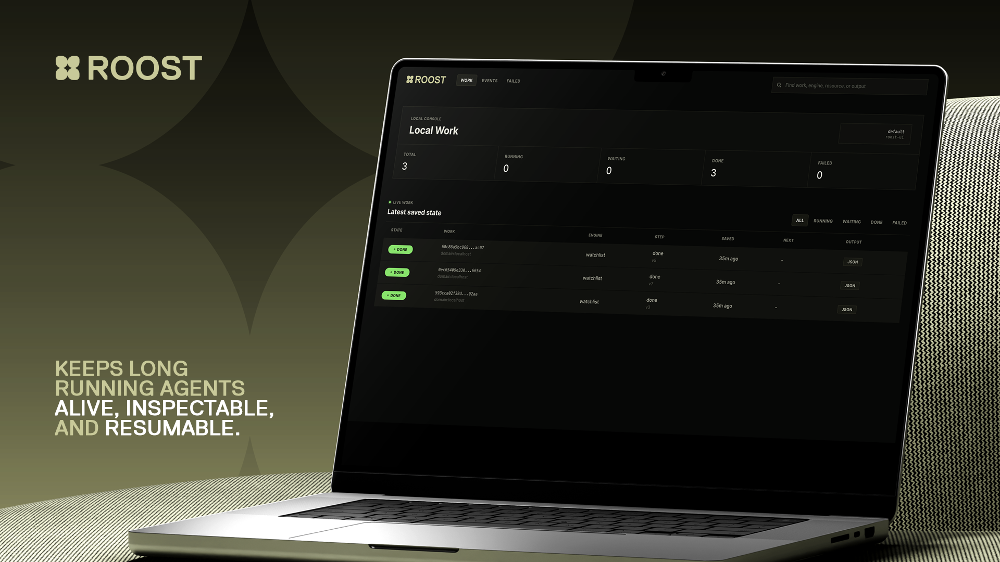
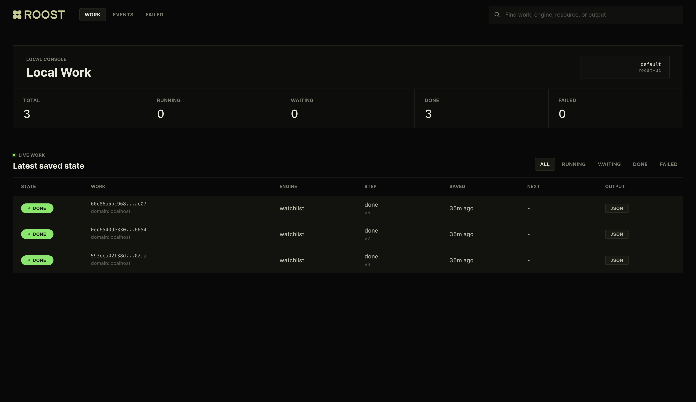
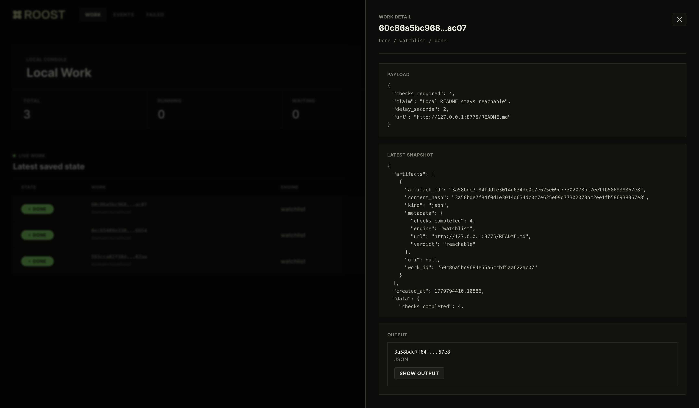

# Roost Runtime



Roost is a tiny Redis-backed runtime for long-running agent workers: persist a
snapshot after every step, lease work to one worker at a time, and resume safely
after crashes.

Agent demos are easy. Long-running agent workers are not.

The moment an agent leaves a notebook or chat session, the hard problems change:

- What work exists?
- Which worker owns it right now?
- What was the last durable step?
- Can another worker resume after a crash?
- Which resources are locked?
- What did the agent produce?
- Can operators inspect, retry, replay, or dead-letter the work?

Roost exists for that layer.

```text
Queue
  -> acquire lease
  -> load latest Snapshot
  -> Engine.step(snapshot, item)
  -> compare-and-swap save Snapshot
  -> re-enqueue or mark done
```

Bring your own engine. Roost handles the operational substrate: work items,
snapshots, leases, retries, resource claims, delayed continuation, artifacts,
status indexes, events, and dead-letter recovery.

Roost does not help an agent think. Roost helps an agent keep going.

## Quickstart

Install dependencies:

```bash
uv sync --extra redis --extra dev
```

Create a local config:

```bash
uv run roost init
```

Start Redis:

```bash
docker run --rm -p 6379:6379 redis:7
```

Check the local setup:

```bash
uv run roost doctor
```

In one terminal, run a worker:

```bash
uv run roost worker --engines watchlist
```

In another terminal, enqueue a watchlist job:

```bash
WORK_ID=$(uv run roost enqueue \
  --engine watchlist \
  --resource domain:example.com \
  --payload '{"url":"https://example.com","claim":"Example Domain is reachable","checks_required":3,"delay_seconds":5}')

uv run roost status "$WORK_ID"
```

The final status includes a JSON artifact id. To print the evidence report:

```bash
uv run roost artifact-show <artifact_id> --ext json
```

Now kill the worker with `Ctrl-C`, wait a moment, and start it again:

```bash
uv run roost worker --engines watchlist
uv run roost status "$WORK_ID"
```

The watchlist engine fetches the URL once per runtime step, records an
observation in the durable snapshot, waits between checks, and writes a final
JSON evidence report artifact. Because Roost saves a snapshot after each step,
the restarted worker resumes from the latest persisted observation instead of
starting over.

Inspect recent runtime events:

```bash
uv run roost events
```

The final `status` output includes the persisted observations and artifact
metadata. Abridged:

```json
{
  "meta": {"state": "done", "step": "done"},
  "snapshot": {
    "version": 4,
    "data": {
      "checks_completed": 3,
      "verdict": "reachable",
      "observations": [
        {"ok": true, "status": 200, "url": "https://example.com"}
      ]
    },
    "artifacts": [
      {
        "kind": "json",
        "artifact_id": "59212cee...",
        "metadata": {"verdict": "reachable", "checks_completed": 3}
      }
    ]
  }
}
```

No LLM key is required. The point of the demo is the runtime behavior: durable
state, leases, delayed continuation, resource claims, inspection, and artifacts.

To run the full local e2e, including worker restart and final artifact printing:

```bash
scripts/e2e_watchlist.sh
```

## Local Console

Roost also includes a small local console for inspecting work without reading raw
JSON in the terminal:

```bash
uv run roost ui
```

Open `http://127.0.0.1:8766` to see live work, recent events, failed work, and
JSON artifacts. The console is local-only by default and uses the same Redis
prefix, namespace, and artifact root settings as the CLI.



The console keeps the runtime layer visible: live work, saved snapshots, event
history, failures, and output artifacts.



## Engine Contract

Engines own domain-specific state transitions. The runtime owns durability.

```python
from roost.runtime.models import Snapshot, WorkItem


class Engine:
    engine_id: str

    async def init_snapshot(self, item: WorkItem) -> Snapshot: ...
    async def step(self, snapshot: Snapshot, item: WorkItem) -> Snapshot: ...
```

A minimal engine:

```python
from roost.runtime.models import Snapshot, WorkItem


class MyEngine:
    engine_id = "my-engine"

    async def init_snapshot(self, item: WorkItem) -> Snapshot:
        return Snapshot(
            work_id=item.work_id,
            engine=self.engine_id,
            step="start",
            data={"payload": item.payload},
        )

    async def step(self, snapshot: Snapshot, item: WorkItem) -> Snapshot:
        new_snapshot = snapshot.model_copy()
        new_snapshot.step = "done"
        new_snapshot.is_finished = True
        return new_snapshot


def build_engine(**kwargs):
    return MyEngine()
```

Expose it as an entry point:

```toml
[project.entry-points."roost.engines"]
my-engine = "my_package.engine:build_engine"
```

Then run:

```bash
uv run roost worker --engines my-engine
uv run roost enqueue --engine my-engine --payload '{"task":"ship it"}'
```

## What Roost Provides

- `WorkItem`: durable unit of work.
- `Snapshot`: replayable engine state after each step.
- `Lease`: time-bound worker ownership.
- `Artifact`: content-addressed output produced by an engine.
- `Engine`: small async contract for pluggable execution.
- `RedisSwarm`: Redis + SAQ backed scheduler, lease manager, retry loop, and recovery path.

Runtime guarantees:

- at-least-once execution
- optimistic snapshot persistence
- per-work leases with renewal
- optional resource locks
- delayed continuation via `next_step_delay_seconds`
- orphan recovery when a worker dies mid-step
- status metadata and event stream
- bounded retries and dead-letter queue

Engines should make `step()` safe to retry from the same snapshot. Roost keeps
the latest accepted snapshot version and uses compare-and-swap persistence to
avoid overwriting newer progress.

## CLI

```bash
uv run roost init
uv run roost doctor
uv run roost engines
uv run roost enqueue --engine watchlist --payload '{"url":"https://example.com"}'
uv run roost worker --engines watchlist --concurrency 4
uv run roost status <work_id>
uv run roost inspect <work_id>
uv run roost list
uv run roost events
uv run roost retry <work_id>
uv run roost cancel <work_id>
uv run roost dlq list
uv run roost dlq replay 0 --ack
uv run roost artifact-show <artifact_id> --ext json
uv run roost ui
uv run roost workspace-path <work_id>
```

Useful environment variables:

- `ROOST_REDIS_URL`
- `ROOST_QUEUE`
- `ROOST_REDIS_PREFIX`
- `ROOST_NAMESPACE`
- `ROOST_ARTIFACT_ROOT`

`roost.toml` uses the same settings in file form. CLI flags override
environment variables, and environment variables override `roost.toml`.

## How It Differs

Roost is not a replacement for LangChain, LlamaIndex, CrewAI, AutoGen,
Temporal, Celery, or your own agent loop. It sits at a different layer.

| Tool category | Great for | Roost's difference |
| --- | --- | --- |
| LangChain-style frameworks | Prompts, tools, retrieval, chains, agent composition | Roost does not prescribe cognition. It runs any engine as a durable step-machine. |
| Temporal-style workflow engines | General distributed workflows with strong orchestration semantics | Roost is smaller and agent-shaped: snapshots, resources, artifacts, and resumable engine steps without a workflow DSL. |
| Celery-style queues | Fire-and-forget background jobs | Roost persists progress after every step, renews leases, recovers orphaned work, and exposes agent state. |
| Cron/scripts | Simple repeated automation | Roost gives long-running work identity, retry state, locks, events, DLQ, and inspection. |

The short version:

```text
LangChain helps decide what an agent should do.
Temporal helps coordinate workflows.
Celery runs jobs.
Roost keeps long-running agents alive, inspectable, and resumable.
```

## Test

```bash
uv run --extra dev --extra redis pytest -q
uv run --extra dev ruff check .
```

## Roadmap

Roost is moving toward a production-grade runtime/control plane for durable
agent work while keeping the engine contract small. The near-term path is OSS
adoption first, Postgres as the production system of record, Redis for local and
lightweight runtime setups, and bring-your-own workers before any managed
execution.

Read the full phase-gated roadmap in [ROADMAP.md](ROADMAP.md).

## Limitations

- The current backend is Redis + SAQ.
- Execution is at-least-once, so engines must make `step()` retry-safe from the
  same snapshot.
- Roost stores the latest snapshot for each work item; engines should put large
  outputs in artifacts.
- This is not a workflow DSL, prompt framework, hosted control plane, or model
  router.

## What This Is Not

Roost is not a prompt framework, model router, or agent personality system. It is
the runtime underneath those systems.

The goal is not to replace your agent framework. The goal is to make your agent
framework survive contact with production.
